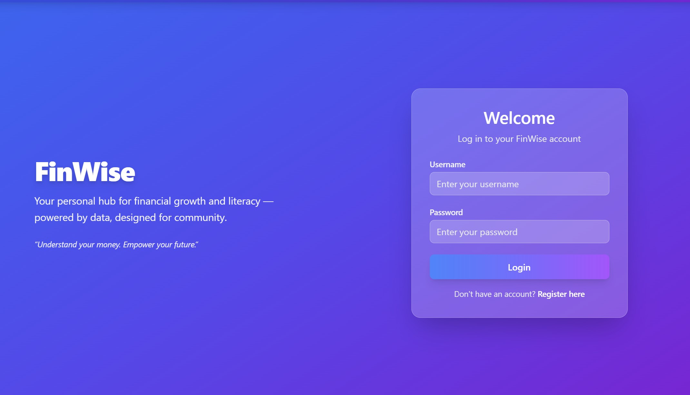
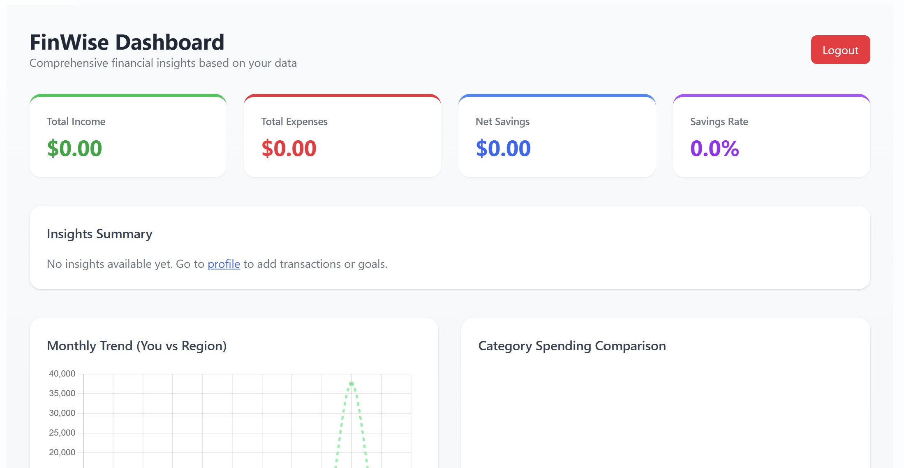
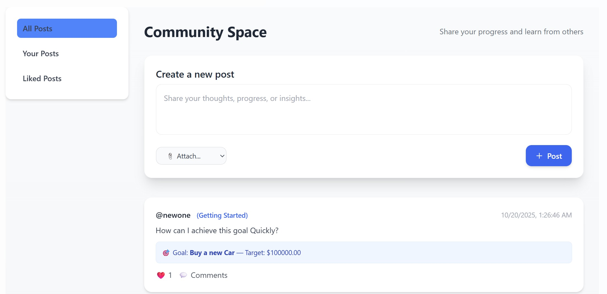

# 🧭 FinWise: Community Financial Literacy Dashboard

**FinWise** is a modern, interactive web platform designed to help individuals and communities **improve financial literacy** and **manage personal finances** effectively.  
It combines **financial tracking tools** with a **social community space**, empowering users to learn, share, and grow together.

---

## 📸 Screenshots Overview




---

## Features

### Core Financial Tools
- **Financial Goals Management**
  - Add, edit, view, and delete financial goals.
  - Track goal progress with visual charts.
  - Integration with transactions for real-time goal progress updates.

- **Transaction Tracking**
  - Record income, expenses, and transfers.
  - Categorize transactions to analyze spending behavior.
  - Full CRUD functionality for complete management.

- **Analytics Dashboard**
  - Visualize spending and savings with **interactive charts**.
  - Overview of total income, expenses, and goal completion.
  - Filter-based insights (weekly, monthly, yearly).

---

### Community & Social Features
- **Community Posts**
  - Users can create posts to share financial tips, updates, and achievements.
  - Display posts in a modern, visually appealing layout using TailwindCSS.
  - Posts include likes, comments, and author information.

- **Likes & Comments**
  - Like/unlike posts in real time.
  - Comment threads with user identity and timestamps.
  - Dynamic comment expansion with an attractive curved arrow “open comments” connector.

- **Modern Frontend Design**
  - Fully responsive interface using **TailwindCSS**.
  - Smooth animations and clean UI for a community-driven experience.

---

### User Authentication
- Secure user registration and login system (Django Auth).
- Session management with CSRF protection.
- Personalized dashboards after authentication.

---

## Tech Stack

| Layer | Technology |
|-------|-------------|
| **Backend** | Django + Django REST Framework |
| **Frontend** | HTML, JavaScript, TailwindCSS |
| **Database** | PostgreSQL |
| **Serialization** | DRF Serializers (for Goals, Transactions, Posts, Comments) |
| **Charts** | Chart.js for dynamic data visualization |
| **Auth** | Django built-in authentication system |

---

## Key Features Implemented So Far

- ✔️ Financial goals with progress tracking  
- ✔️ Transaction CRUD with categorization  
- ✔️ Beautiful dashboard with visual charts  
- ✔️ Community posts, likes, and comments  
- ✔️ Responsive TailwindCSS frontend  
- ✔️ Authentication & user sessions  
- ✔️ Modern, connected UI between dashboard and community  

---

## Setup Instructions

### 1. Clone the repository
```bash
git clone https://github.com/yourusername/finwise.git
cd finwise
```
### 2. Create and activate a virtual environment
```bash
python -m venv venv
source venv/bin/activate
```
### 3. Install dependencies
```bash
pip install -r requirements.txt
```
### 4. Apply migrations
```bash
python manage.py makemigrations
python manage.py migrate
```
### 5. Run the development server
```bash
python manage.py runserver
```
### 6. Open in browser
```bash
Go to http://127.0.0.1:8000
```
## Development Notes

* Uses Django REST Framework to serve APIs for goals, transactions, and community posts.
* Frontend templates are integrated with TailwindCSS for styling.
* Uses AJAX (JavaScript) for dynamic like/comment updates.
* Each app (core, community, users) is modular and can be extended easily.